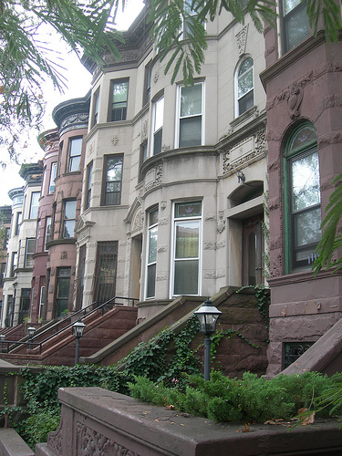
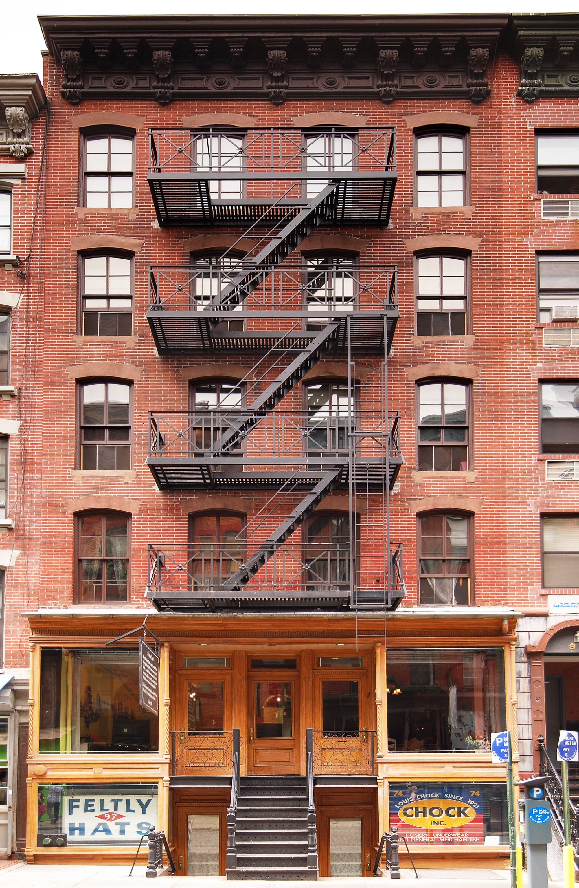
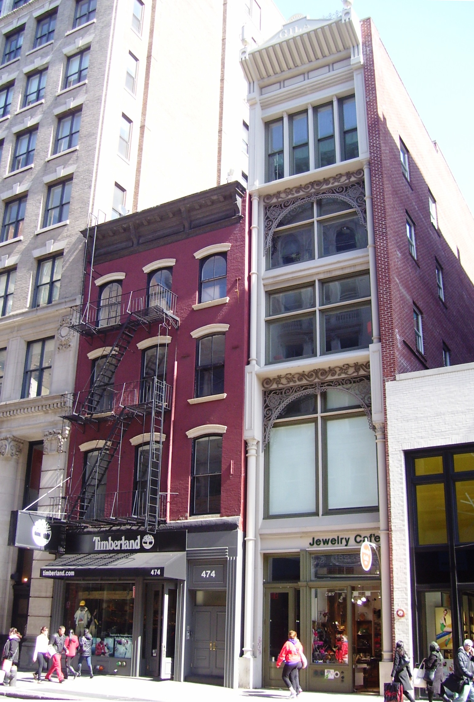
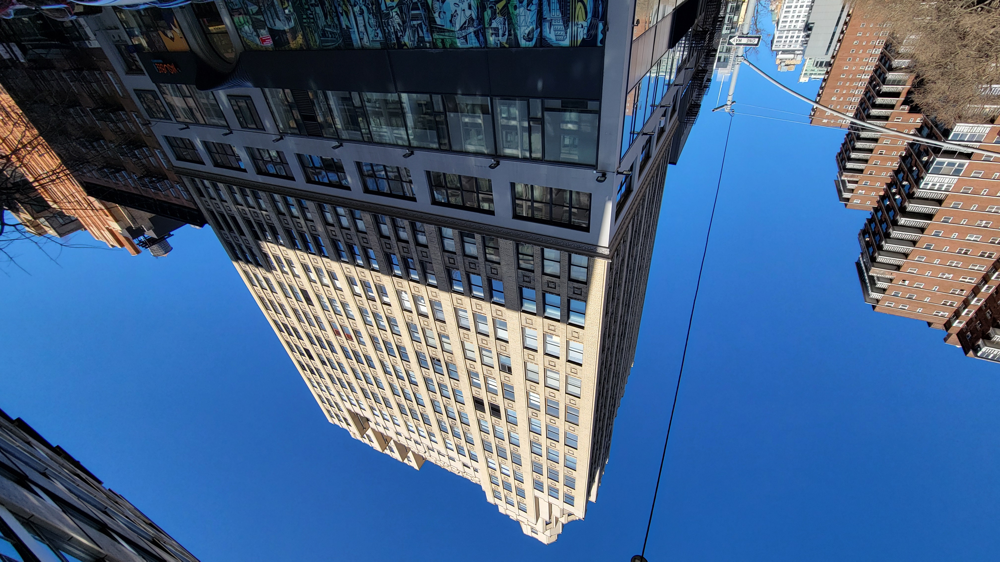

# NYC building fabric and photo references

**Research date:** 2026-09-15. **Standing direction:** future visual development should reinforce an original NYC-inspired neighborhood, rather than a generic town of isolated buildings. Keep fictional streets, original architecture and unbranded scenery. This study supplements the [earlier NYC research](NYC_CITY_RESEARCH.md), [art specification](ART_AND_ASSETS.md#nyc-building-fabric---2026-09-15) and [product boundary](PRODUCT_BRIEF.md).

## Evidence and limitations

The user's supplied screenshot shows separated building masses and repeated apartment-like elevations. That is an `observed` property of the supplied scene, not a measurement of NYC. The second supplied screenshot and new reference photographs could not be visually inspected because this session's image-viewing quota was exhausted.

The guidance below was independently retrieved and its text checked. Institutional statements and Commons captions are `operator-declared`; architectural recommendations are `inferred` or `proposed`, not recovered dimensions. The four photographs are retained unchanged with verified Commons license metadata, dimensions and SHA-256 hashes in the [image manifest](../research/nyc-building-fabric/image-manifest.json). **Their captions are not pixel observations.** No statistical survey established an NYC-wide adjacency percentage, building-use distribution or facade dimensions. These references do not certify the miniature against building, accessibility or traffic regulations.

Research is inert reference. No photograph, business name, logo, texture, font, model or traced facade is incorporated into runtime assets. Licensing a photograph does not authorize copying visible branding. Original photo files remain unchanged; the credited CC BY-SA terms apply to their redistribution and adaptations.

## Verified guidance

| Source | Source statement (`operator-declared`) | Application to this original city (`inferred` / `proposed`) |
| --- | --- | --- |
| [NYC Planning: ZR 23-431, Street wall location](https://zr.planning.nyc.gov/article-ii/chapter-3/23-431) | Named contextual districts use adjacent-building alignment or percentage-based street-wall rules, while allowing specified recesses, courts and articulation. | Form coherent attached groups and consistent avenue frontages, with varied individual facades. Do not treat the rule as universal across NYC. |
| [NYC Planning: ZR 23-335, Side yards](https://zr.planning.nyc.gov/article-ii/chapter-3/23-335) | In the named R6-R12 districts, some detached one-/two-family residences require two five-foot side yards. Other residential types do not require side yards; provided open side-lot areas have specified minimums. | Avoid a mandatory narrow gap around every building. Retain deliberate separated buildings and meaningful passages; the miniature's joint width is not a zoning dimension. |
| [NYC Planning: ZR 23-342, Rear yards](https://zr.planning.nyc.gov/article-ii/chapter-3/23-342) | Rear-yard requirements vary with attachment/type, lot width, height and shallow-lot exceptions; specified cases include 20- and 30-foot depths. | Continuous street-facing rows can coexist with open space behind them. Do not fill whole blocks merely to make the fronts denser. |
| [New York Landmarks Conservancy: 428 Greene Avenue Restoration](https://nylandmarks.org/news/428-greene-avenue-restoration/) | Describes an 1886 Neo-Grec brownstone row and restoration of a brownstone facade, stoop, wooden cornice and window surrounds. | Retain residential stoops, taller principal windows, cornices and narrow-lot rhythm without reproducing that building. The article's photographs were not retained; no reuse license was established. |
| [National Park Service: Preservation Brief 11, Rehabilitating Historic Storefronts](https://www.nps.gov/orgs/1739/upload/preservation-brief-11-storefronts.pdf), H. Ward Jandl, 1982; [publication index](https://www.nps.gov/orgs/1739/preservation-briefs.htm) | Describes display windows flanking doors, lower solid panels, transoms, frequently recessed entrances and separate upstairs access. Guidance respects the horizontal separation of ground-floor storefronts from upper stories. | Give mixed-use buildings a distinct ground-floor layer, wide display bays, a fascia and separate upper-floor entrance. This is national preservation guidance, not an NYC-specific contemporary accessibility specification. |
| [NYC DOT: Clear Path](https://www.nycstreetdesign.info/furniture/clear-path) | Defines the unobstructed sidewalk movement zone and distinguishes general guidance from element-specific requirements; furniture generally occupies a separate furnishing zone. | Preserve existing walking channels, crossing landings, park gates, bicycle tracks and court approaches. Do not obtain density by consuming public circulation. |

The planning-glossary/LPC storefront pages and one Tenement Museum page returned access errors; no conclusions depend on their unavailable text. A SoHo designation-report PDF endpoint was reachable, but its substantive content was not verified in this pass. Historical descriptions below remain attributed to Commons metadata.

## Retained real-life photographs

These are attributed reference candidates with verified license metadata, **not visually inspected photographs in this session**. Open the local images or their source pages for visual comparison.

### P1 - Stuyvesant Heights brownstone row

[Commons source](https://commons.wikimedia.org/wiki/File:Brooklyn_brownstones_in_Stuyvesant_Heights_built_between_1870-1899.jpg). **Vaguynny**, September 2008, [CC BY-SA 3.0](https://creativecommons.org/licenses/by-sa/3.0/). Commons identifies brownstones in Stuyvesant Heights and classifies the photograph as Brooklyn row houses. Proposed use: compare residential lot rhythm, stoops and cornices with the original miniature. The 375 x 500 original limits detail; no facade measurements were extracted.

### P2 - 97 Orchard Street

[Commons source](https://commons.wikimedia.org/wiki/File:97_Orchard_Street_Front.jpg). **Fletcher6**, 2010-05-22, [CC BY-SA 3.0](https://creativecommons.org/licenses/by-sa/3.0/). Commons identifies the Lower East Side Tenement Museum. Proposed use: compare the organization of a tenement facade and its street-level base. This is now a museum; neither current residential occupancy nor an operating storefront is established by the building's historical type.

### P3 - Broadway store-and-loft buildings

[Commons source](https://commons.wikimedia.org/wiki/File:472-474_Broadway.jpg). **Beyond My Ken**, 2012-03-27, [CC BY-SA 4.0](https://creativecommons.org/licenses/by-sa/4.0/). Commons describes 472 Broadway as an 1878 store-and-loft building with a cast-iron Broadway facade, and 474 Broadway as an 1863 store-and-dwelling building with brick and cast-iron elements. Proposed use: compare a distinct retail ground floor with the repeated upper-floor bays. Historical claims are Commons metadata, not independently corroborated LPC findings here.

### P4 - Ordinary Chelsea office building

[Commons source](https://commons.wikimedia.org/wiki/File:26th_St_8th_Av_td_(2025-03-02)_04_-_322_Eighth_Avenue.jpg). **Tdorante10**, 2025-03-02, [CC BY-SA 4.0](https://creativecommons.org/licenses/by-sa/4.0/). Commons identifies an office tower at Eighth Avenue and 26th Street, Chelsea, photographed looking upward. Proposed use: compare office glazing repetition and vertical divisions without copying a famous landmark. Ground-floor detail and the actual appearance of the photograph were not independently observed.

## Implemented interpretation

The supplied city image and verified written guidance, rather than uninspected photo details, informed this implementation:

- **Denser building groups:** 57 former gaps become 0.06 m construction joints across 75 of the existing 94 buildings. Both adjoining lot-line faces remain blank; roof trims do not overlap the neighbors. This is an authored miniature joint, not a measured NYC separation.
- **Purposeful open space:** planted plazas, metro mouths, bicycle-station access, court runoffs and the shared passage remain. An existing diagonal view into the east-south subway entrance is retained.
- **Mixed uses:** 19 office buildings have broad repeated glazing and masonry or curtain-wall treatments; 32 mixed-use buildings have ground-floor display bays, transoms, canopies and separate upstairs doors. Forty-three buildings remain residential. These ratios are artistic choices, not NYC statistics.
- **Original and bounded:** no grid expansion, building-count increase, copied business branding, runtime photographs, retail interaction, population change or new simulation system. Public circulation, weather, lighting, pause/recovery and existing controls remain.

Current verification and the unresolved visual-inspection limitation are recorded in [acceptance criteria](ACCEPTANCE_CRITERIA.md#nyc-building-fabric---2026-09-15).
